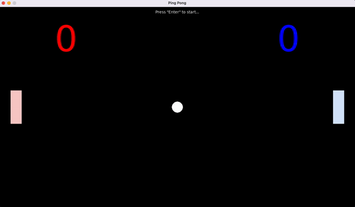

# Ping Pong

A Ping Pong game inspired by the course "CS50's Introduction to Game Development" written using LÖVE (free, open-source, cross-platform framework released under the zlib license for developing video games) and the Lua programming language.

# Screenshots

## Getting Started

To run game you need to use LÖVE.

### Prerequisites

* LÖVE (minimum 11.5). Download from [LÖVE. Downloads](https://love2d.org/#download).

### LÖVE Installation and game running

For installing LÖVE and running game you can use this guide - [LÖVE. Getting Started](https://love2d.org/wiki/Getting_Started).
